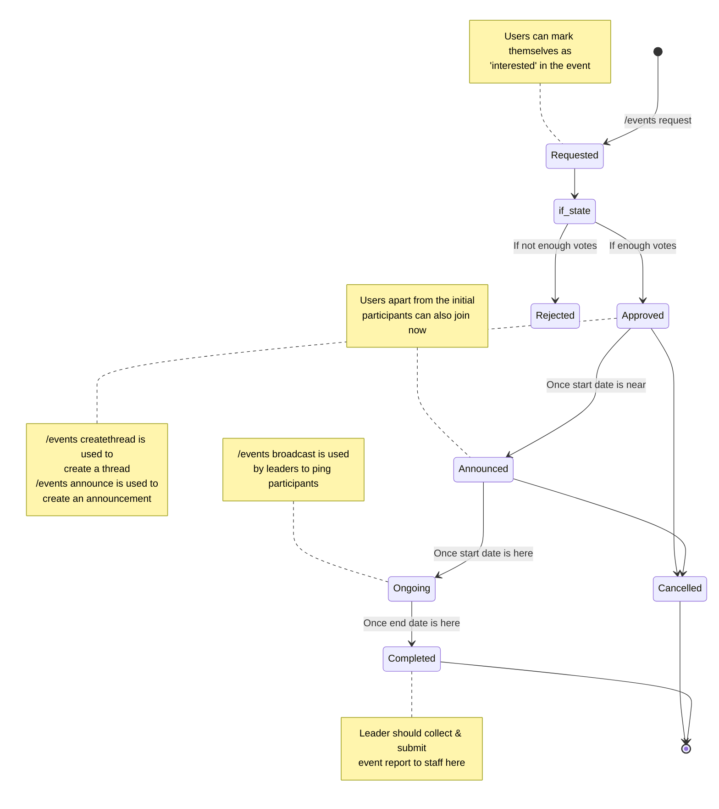

# Events

The `/events` command group contains commands related to interacting and managing all server reading events

## Commands

All commands listed below can be used after typing `/events` in the chat bar on Discord.

?\> See [Event Types](#event-types) and [Event States](#event-states) sections for available options and what they mean

| Command                               | Description                                                                                                                                                      |
| ------------------------------------- | ---------------------------------------------------------------------------------------------------------------------------------------------------------------- |
| info \<id\>                             | Fetches the info for a single event                                                                                                                              |
| list [type] [status]                  | Fetches a list of events, filtered according to the options                                                                                                      |
| search \<query\> [type] [status]        | Fetches a list of events, filtered via `query` and options                                                                                                       |
| stats [user]                          | Fetches the server event stats for a user                                                                                                                        |
| request \<type\>                        | Makes a request for a server reading event                                                                                                                       |
| broadcast \<id\> [channel]              | Pings all the participants of an event in the event channel, unless otherwise specified                                                                          |
| edit \<id\> \<field\> \<value\>             | Updates the `field` of an event with the given `value`                                                                                                           |
| createthread \<id\> [channel] [title]   | Creates or updates a thread for an event. If `title` is given, sets the title of the thread. If `channel` is given, creates a new thread/message in that channel |
| announce \<id\> [channel]               | Makes an announcement for an approved event. If `channel` is given, does it in that channel                                                                      |
| adduser \<id\> \<user\> \<type\> [points=5] | Adds a user as participant of type `type` to the event, and gives them `points`                                                                                  |
| removeuser \<id\> \<user\> \<type\>         | Removes a user as a participant from the event                                                                                                                   |

## Event Lifecyle

### Event Types

An event can be of the following types:

- **BuddyRead**: A server read organized and lead by any member of the server. Staff involvement is minimal, and it is the BR Leader's responsibility to start and lead discussions.
- **MonthlyRead**: A monthly read for the server-wide Book of the Month. No assigned leader, upto staff to lead if necessary.
- **ShortStoryRead**
- **WeeklyRead**
- **PoetryRead**
- **Other**

### Event States

!\> Currently, all event state change must be done manually by staff using the `/events edit` command. This may be automated in the future.

At any point in time, an event must have one of the following as its status:

- **Requested**: Here is where the event must garner enought interest (votes) before it's proposed start date.
- **Approved**: Event has enough interest to qualify for a server-wide read. Next steps are upto staff to create a place for discussion (`/events createthread`) and tell interested folks about the same (`/events announce`)
- **Announced**: A dedicated thread has been created, and the event announcement has been made. This should be done just a few days before the event start date.
- **Ongoing**: An Announced event state should change to ongoing between the event's start date and end date
- **Completed**: Once the end date of the event has passed, the event should be marked as Completed
- **Rejected**: If a **Requested** event does not garner enough interest, it should move to a **Rejcted** state.
- **Cancelled**: If for some reason the event needs to be cancelled, this state can be used.
