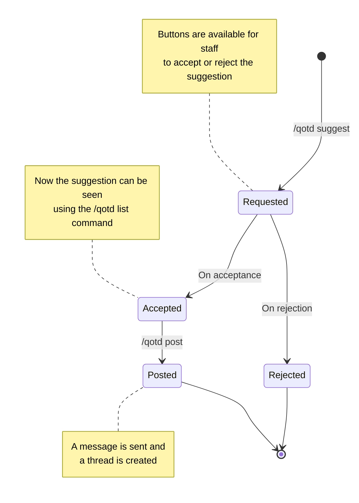

# QOTD

The `/qotd` command group is for commands related to Question of the Day stuff.

## What's a QOTD?

A QOTD stands for Question Of The Day. A daily question is posted in a specified channel (usually, but not always) book-related, and people answer it.

## Commands

All commands listed below can be used after typing `/qotd` in the chat bar on Discord.

| Command             | Description                                                                                                                                  |
| ------------------- | -------------------------------------------------------------------------------------------------------------------------------------------- |
| suggest \<question\>  | Suggests a question                                                                                                                          |
| list                | Lists the available questions                                                                                                                |
| post \<id\> [channel] | Posts a QOTD and creates a thread for it. Selects a random QOTD if id is not given. Selects a pre-configured channel if channel is not given |

## QotD Lifecycle

