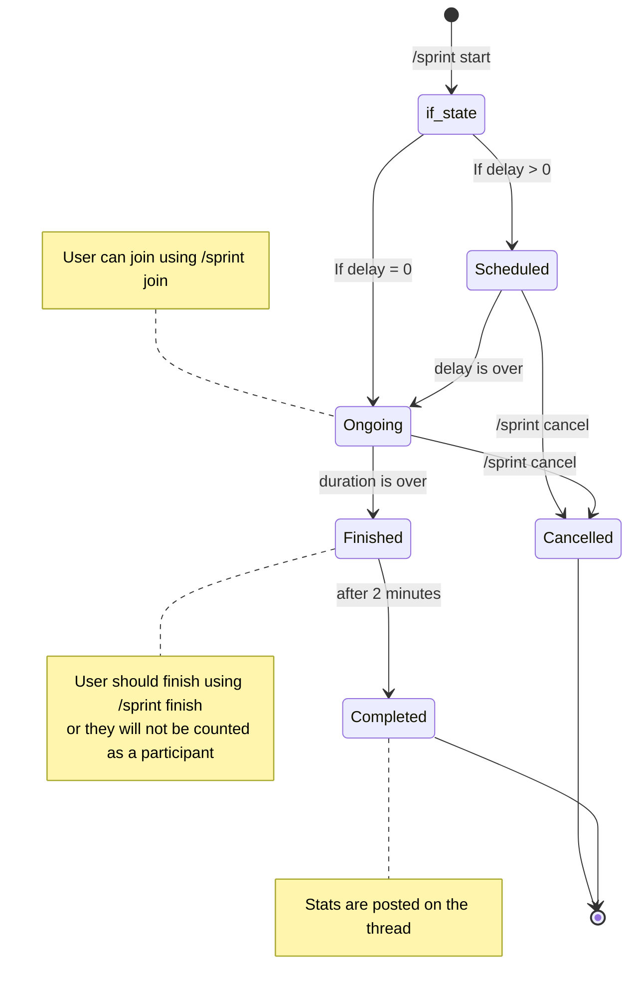

# Sprint

The `/sprint` command group contains all commands related to interacting with reading sprints in the server.

## What are Reading Sprints?

~~It's when you go on a run while reading a book~~

Reading sprints are when people will focus on reading as many pages while still comprehending the text.

## Commands

All commands listed below can be used after typing `/sprint` in the chat bar on Discord.

| Command                    | Description                                                                                                                                   |
| -------------------------- | --------------------------------------------------------------------------------------------------------------------------------------------- |
| start \<duration\> [delay=0] | Schedules a sprint of the given `duration` (in minutes) in the current channel/thread. If specified, the start is delayed by the given amount |
| join [count=0]             | Enables a user to join an ongoing sprint with an initial page count                                                                           |
| finish \<count\>             | Once a sprint has finished, enables a user to log their end page count                                                                        |
| status                     | Shows the current status of the sprint (if present) in the current channel                                                                    |
| cancel                     | Cancels a sprint in the current channel                                                                                                       |
| leave                      | Enables a user to leave an ongoing sprint                                                                                                     |
| stats [user]               | Shows the total sprint stats of a user                                                                                                        |

## Sprint Lifecycle
(Refresh this page if the diagram is not visible)

