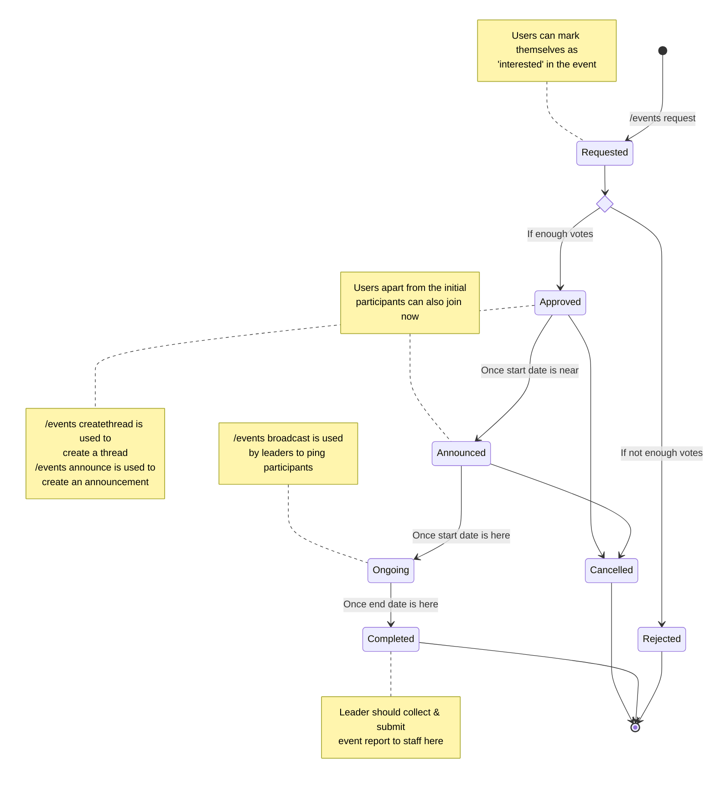

# Events

Events here implies the various community reading events that take place in the server, including Buddy Reads, the BOTM, and any other official server-wide reading events.

Before you can effectively use the commands, you should know what is meant by **type** and **status**. These are used as arguments in almost all commands related to events.

## Event Types

An event can be of the following types:

- **BuddyRead**: Organized and lead by any member of the server. Staff involvement is minimal, and it is the BR Leader's responsibility to start and lead discussions.
- **MonthlyRead**: A monthly read for the server-wide Book of the Month. No assigned leader, upto staff to lead if necessary.
- Other types which are not as widely used are **ShortStoryRead**, **WeeklyRead**, **PoetryRead**. You should not use these types unless explicitly told to do so.

## Event Lifecycle

At any point in time, an event will have an associated state/status.

The initial state of any event will be **Requested**. Depending on the how many members of the server are interested in participating, a Requested event can move to either **Approved** or a **Rejected** state. As the event's start date approaches and it has already been Approved, a dedicated thread will be created for discussion, and an announcement will be made so that even more interested folks can participate. This is when the the status moves to **Announced**.

Once the event starts (i.e. the start date for the event is here), an Announced event status will change to **Ongoing** and when the end date of the event has passed, the event will be marked as **Completed**.

This diagram below visually explains how an event will move from one state to another.

## Requesting a BuddyRead

1. Request an event with type **BuddyRead** using the `/events request` command in any channel of the server. You will be asked for a URL, the dates for the event, and a reason. Note that for a request to be successful, the URL must be a valid Goodreads or Storygraph URL and the dates **must** be in YYYY-MM-DD format. In case of any errors, please ask staff to edit or delete the event request.
2. A successful event request will create a post in the #br-requests channel. There will be an "Interested" button available below the post. All interested members, (including the requestor), must click the button for the bot to register them as interested participants.
3. Your event will be **Approved** or **Rejected** based on the number of participants it gains before its start date.

## Leading a Buddy Read

Every event will have an associated ID, which you will be able to see on the Event Info Embed, and in the announcement post. You will need to keep this ID handy to use the `/events broadcast` command, which will ping all the interested participants of that event. A BR Leader can use this command to quickly ping all the users of the event, without manually mentioning each and every one of them.

## For Staff: Managing Events

In the ideal, normal workflow, the only action required from staff will be to

- Create a thread for an event using `/events createthread`
- Announce the event using `/events announce`
- Add points once the event is completed using `/events adduser`

However, in case you need to take any more actions or edit the event, you can use the `/events edit` command, which will allow you to edit any of the field values (status, dates etc. ) for an event.
