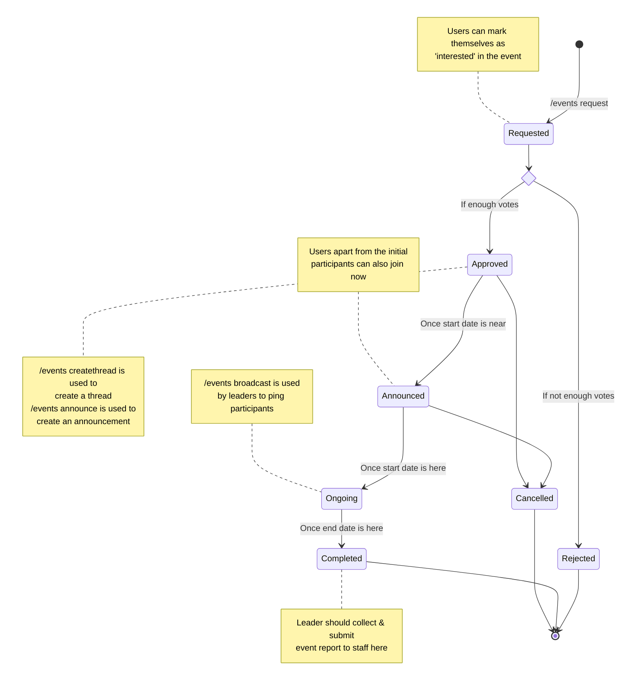

# Events

Events here implies the various community reading events that take place in the server, including Buddy Reads, the BOTM, and any other official server-wide reading events.

Before you can effectively use the commands, you should know what is meant by **type** and **status**. These are used as arguments in almost all commands related to events.

## Event Types

An event can be of the following types:

- **BuddyRead**: Organized and lead by any member of the server. Staff involvement is minimal, and it is the BR Leader's responsibility to start and lead discussions.
- **MonthlyRead**: A monthly read for the server-wide Book of the Month. No assigned leader, upto staff to lead if necessary.
- Other types which are not as widely used are **ShortStoryRead**, **WeeklyRead**, **PoetryRead**. You should not use these types unless explicitly told to do so.

## Event Lifecycle

At any point in time, an event will have an associated state/status.

The initial state of any event will be **Requested**. Depending on the how many members of the server are interested in participating, a Requested event can move to either **Approved** or a **Rejected** state. As the event's start date approaches and it has already been Approved, a dedicated thread will be created for discussion, and an announcement will be made so that even more interested folks can participate. This is when the the status moves to **Announced**.

Once the event starts (i.e. the start date for the event is here), an Announced event status will change to **Ongoing** and when the end date of the event has passed, the event will be marked as **Completed**.

This diagram below visually explains how an event will move from one state to another.

```mermaid
stateDiagram-v2
    state "Requested" as req
    note left of req
        Users can mark themselves as
        'interested' in the event
    end note

    state "Approved" as app
    note right of app
        /events createthread is used to
        create a thread
        /events announce is used to
        create an announcement
    end note

    state "Announced" as ann
    note left of ann
        Users apart from the initial
        participants can also join now
    end note

    state "Ongoing" as ong
    note left of ong
        /events broadcast is used
        by leaders to ping participants
    end note

    state "Completed" as com
    note right of com
        Leader should collect & submit
        event report to staff here
    end note

    state "Rejected" as rej

    state "Cancelled" as can
    state if_state <<choice>>

    [*] --> req : /events request
    req --> if_state
    if_state --> rej : If not enough votes
    if_state --> app : If enough votes
    app --> ann : Once start date is near
    ann --> ong : Once start date is here
    ong --> com : Once end date is here
    app --> can
    ann --> can
    can --> [*]
    com --> [*]
    rej --> [*]
```

## Requesting a BuddyRead

1. Request an event with type **BuddyRead** using the `/events request` command in any channel of the server. You will be asked for a URL, the dates for the event, and a reason. Note that for a request to be successful, the URL must be a valid Open Library, Goodreads, or Storygraph URL and the dates **must** be in YYYY-MM-DD format. For a quicker path, you can also use the **Request Buddy Read** button on a `/book info` result. In case of any errors, please ask staff to edit or delete the event request.
2. A successful event request will create a post in the #br-requests channel. There will be an "Interested" button available below the post. All interested members, (including the requestor), must click the button for the bot to register them as interested participants.
3. Your event will be **Approved** or **Rejected** based on the number of participants it gains before its start date.

## Leading a Buddy Read

Every event will have an associated ID, which you will be able to see on the Event Info Embed, and in the announcement post. You will need to keep this ID handy to use the `/events broadcast` command, which will ping all the interested participants of that event. A BR Leader can use this command to quickly ping all the users of the event, without manually mentioning each and every one of them.

## For Staff: Managing Events

In the ideal, normal workflow, the only action required from staff will be to

- Create a thread for an event using `/events createthread`
- Announce the event using `/events announce`
- Add points once the event is completed using `/events adduser`

However, in case you need to take any more actions or edit the event, you can use the `/events edit` command, which will allow you to edit any of the field values (status, dates etc. ) for an event.

## Staff Action Buttons

Event info embeds (returned by `/events info`, and shown after most staff event commands) now include inline buttons for staff. The buttons shown depend on the event's current status:

- **Edit** — opens a modal to edit status, start/end dates, and linked threads in one form.
- **Approve** / **Reject** — only on _Requested_ events; sets the status accordingly.
- **Create Thread** — on _Approved_ events; equivalent to `/events createthread`.
- **Announce** — on _Approved_ events that already have a thread; equivalent to `/events announce`.
- **Add Points** / **Remove Points** — on _Completed_ events; opens the same forms as `/events adduser` and `/events removeuser`.

Event lists and search results also include a **Details** button per event (and a **Join** button on _Requested_ events) so users can pull up the full info card or register interest without re-running a command.

## Stats and Recognition

Once events start completing, several commands surface aggregated activity:

- **`/events stats [user]`** — per-user breakdown: total points, total pages read, top authors and genres, and per-event-type activity. Optional `preset` (`This Year` / `Last Year` / `This Month`) or a custom `from` / `to` range scopes everything to a date window.
- **`/events serverstats`** — guild-wide rollup: total completed events, breakdown by type, most active month, top books / authors / genres across the server, top readers (across all event types), and top BR leaders (BuddyRead-only). Same date-window options as `stats`.
- **`/user readerboard`** — points-based leaderboard. Optional `type` filters to a single event type; same date-window options. Surfaces your own rank when you appear in the rankings.

## Reader Roles

Staff can configure Discord roles that are auto-assigned by the bot based on a points threshold, scored over an optional time window. This is managed by the `updateReaderRoles` job (runs nightly when `enableEventJobs` is on).

Use `/config setreaderrole <role> <points> [preset]` to define a role:

- **All Time** (default) — permanent threshold roles like `Bookworm` (e.g. 50+ points). Once earned, the role stays unless points drop below the threshold (rare in practice — happens on event edits).
- **This Year** — recognition roles like `Reader of the Year` that reset annually. Holders are revoked when their year-to-date score falls below the threshold (typically when the year rolls over).
- **This Month** — same idea but monthly: `Reader of the Month`.

Use `/config removereaderrole <role>` to retire a role tier or clean up after deleting the Discord role.

The job uses the same scoring as `/user readerboard`, just scoped to each role's configured window.
