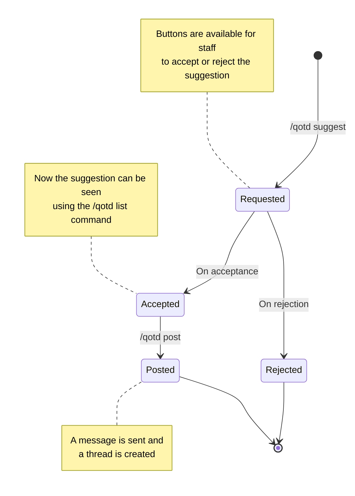

# QotD

A QOTD stands for Question Of The Day. A daily question is posted in a specified channel (usually, but not always) book-related, and people answer it.

As a User, all you need to do is to suggest qotds using the `/qotd suggest` command. Your suggestion will be Accepted or Rejected by Staff, and will be posted accordingly.

## QotD Lifecycle

