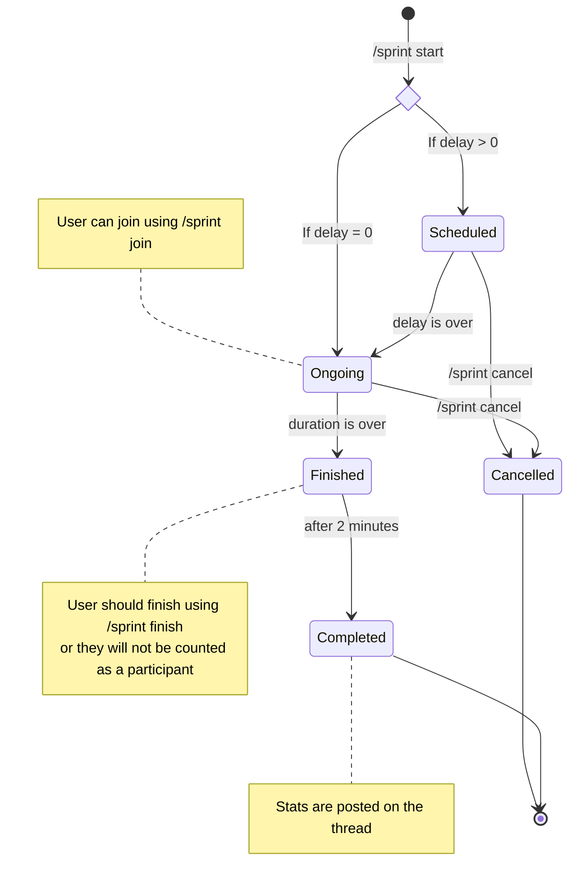

# Reading Sprints

## What are Reading Sprints?

~~It's when you go on a run while reading a book~~

Reading sprints are when people will focus on reading as many pages while still comprehending the text.

## Sprint Lifecycle

