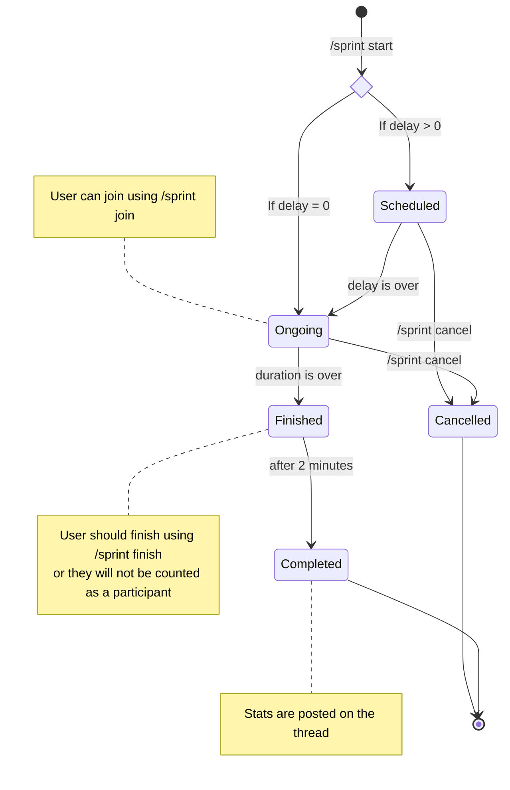

# Reading Sprints

## What are Reading Sprints?

~~It's when you go on a run while reading a book~~

Reading sprints are when people will focus on reading as many pages while still comprehending the text.

## Sprint Lifecycle

```mermaid
stateDiagram-v2
    state if_state <<choice>>

    state "Scheduled" as sch

    state "Ongoing" as ong
    note left of ong
        User can join using /sprint join
    end note

    state "Cancelled" as can

    state "Finished" as fin
    note right of fin
        User should finish using /sprint finish
        or they will not be counted as a participant
    end note

    state "Completed" as com
    note right of com
        Stats are posted on the thread
    end note

    [*] --> if_state : /sprint start
    if_state --> sch : If delay > 0
    if_state --> ong : If delay = 0
    sch --> ong : delay is over
    sch --> can : /sprint cancel
    ong --> can : /sprint cancel
    can --> [*]
    ong --> fin : duration is over
    fin --> com : after 2 minutes
    com --> [*]
```

## Stats and Leaderboards

Once you've participated in a few sprints, two commands surface aggregated activity:

- **`/sprint stats [user]`** — per-user breakdown: sprint count + completion rate, total pages, total time + average pace, personal records (best sprint by pages, fastest by pages/min), and a weekly streak. Optional `preset` (`All Time` / `This Year` / `Last Year` / `This Month` / `Past 7 / 30 / 90 Days`) or a custom `from` / `to` range scopes everything to a date window. The streak's "current" leg is shown only when the window includes this week.
- **`/sprint leaderboard`** — top sprinters in the guild ranked by your chosen `metric` (`Pages read` by default, or `Minutes sprinted` / `Sprints completed`). Same date-window options as `stats`. Paginated; surfaces your own rank when you appear in the rankings.
